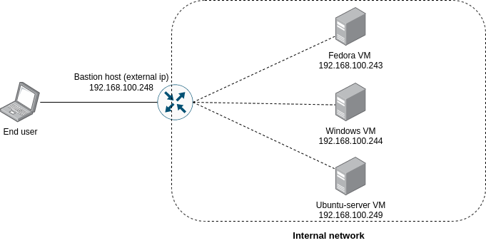

# Multiple OS Rotational Environment based Moving Target Defense



## Testing results data
All the testing results raw data (as well as excel generated charts) are in the corresponding catalogs in the directory `tests`.

### Example DNAT/SNAT routing
```shell
sudo iptables \
--table nat \
--append PREROUTING \
--protocol ALL \
--destination 192.168.100.243 \
--jump DNAT \
--to-destination 192.168.100.244

sudo iptables \
--table nat \
--append POSTROUTING \
--protocol ALL \
--destination 192.168.100.244 \
--jump SNAT \
--to-source 192.168.100.243
```
#### Precondition
Host must have `iptables` installed and `ip_forwarding` enabled. Can be enabled by adding the following line
`net.ipv4.ip_forward=1` to `/etc/sysctl.conf` file.  (for the setting to take effect after appending file, run `sysctl -p`)

### Building
When inside the project root directory, execute the following line: 
`./gradlew build`
the executable `jars` will have the following paths:
* `daemon/build/libs/daemon.jar`
* `service/build/libs/service-0.0.1-SNAPSHOT.jar`  

The jars can be run by executing `java -jar <path_to_.jar>`.
Another way of running is calling `bootrun` task on both applications separately, i.e.:
* `./gradlew daemon:bootrun`
* `./gradlew service:bootrun`
#### Prerequisite
In order to run, JRE 11 must be installed.